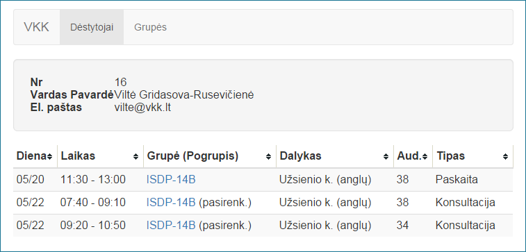
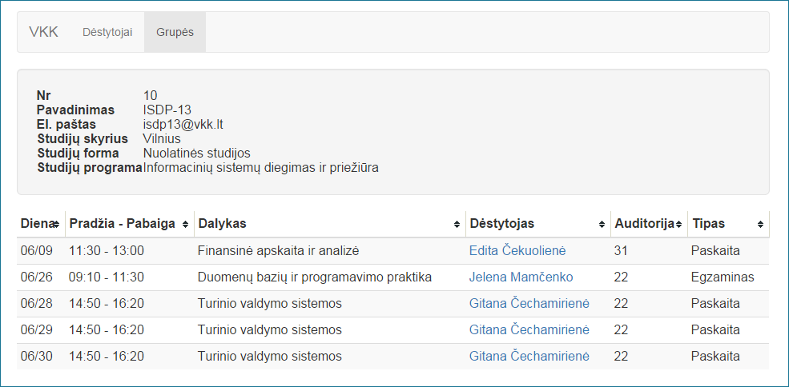
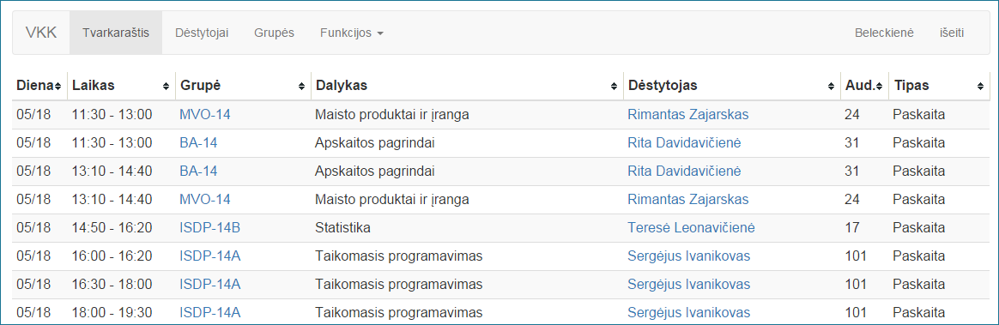
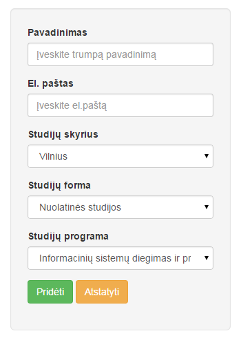
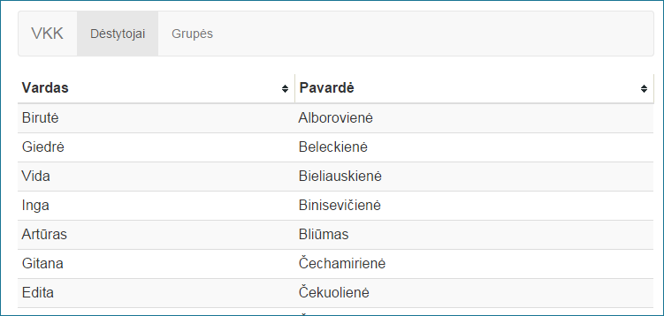
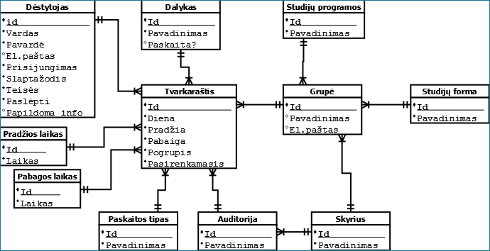
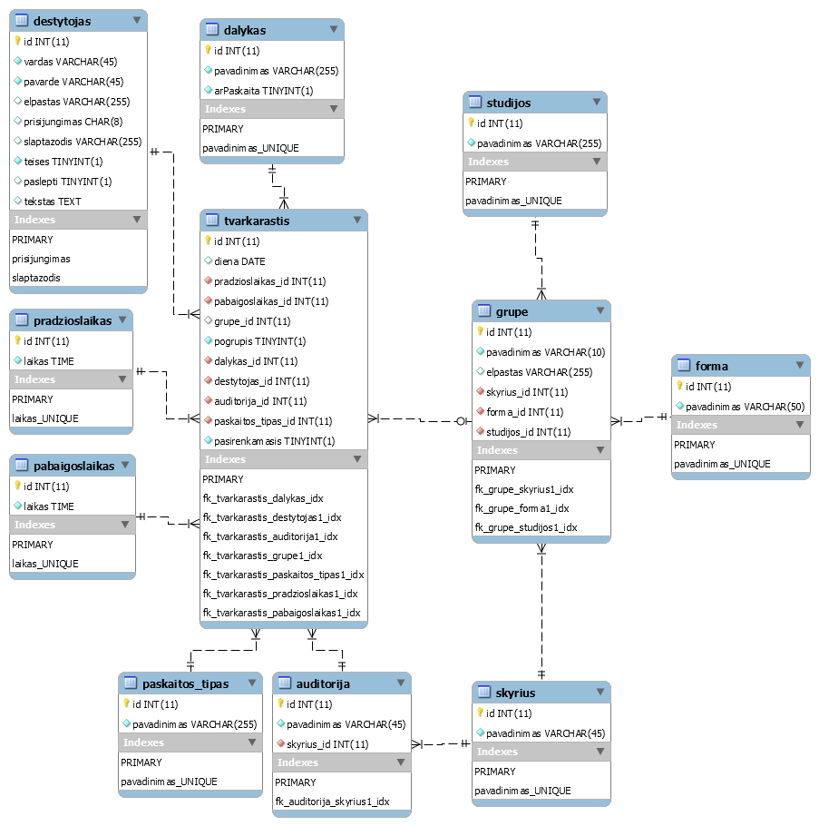
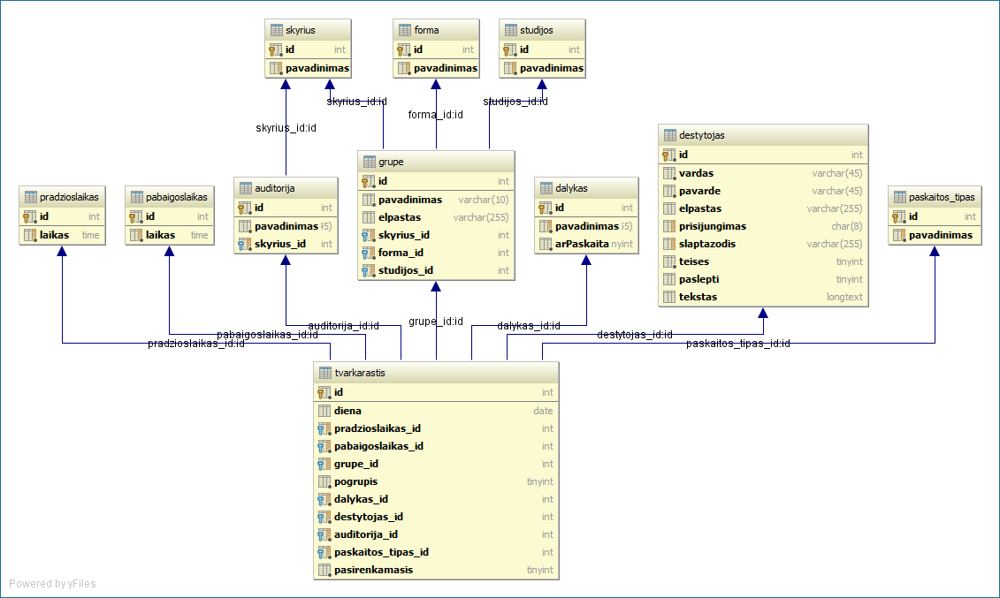

Tvarkaraščio web aplikacija
========================

Naudojama [jQuery](https://jquery.com/)  1.11.3  javascript biblioteka.  
Naudojama [Bootstrap](getbootstrap.com "Bootstrap") 3.3.4 front-end karkasa.  
[tablesorter](http://tablesorter.com/docs/) 2.0.5 lentelių duomenims filtruoti  
[Bootstrap Multiselect](https://github.com/davidstutz/bootstrap-multiselect) 2.0 jquery plugin'as formos duomenims "dropdown" elemente.  
<strike>[Awesome Bootstrap Checkbox](https://github.com/flatlogic/awesome-bootstrap-checkbox)</strike> Bootstrap pluginas checkbox formų v0.3.4.  
[bootstrap-datepicker](https://github.com/eternicode/bootstrap-datepicker) datos įvestims.  
[stidges/jquery-searchable](https://github.com/stidges/jquery-searchable) jQuery pluginas, paieškai gyvose lentelėse. Versija 1.11.3.

Duomenys saugomi MySQL duomenų bazėje.

## Ekrano vaizdai:
### Dėstytojo paskaitos 
### Grupės paskaitos 
### Visi tvarkaraščiai /rodoma tik prisijungus kaip dėstytui arba adminui 
### Grupės kūrimo forma 
### Visų dėstytojų lentelė /tas pats su grupėm 

## Duomenų bazių modeliai:
### Koncepcinis modelis 

### Loginis modelis 

### Fizinis modelis  

